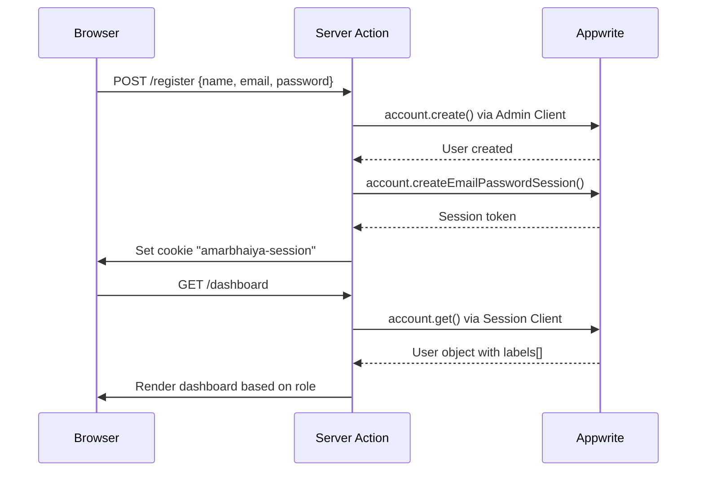
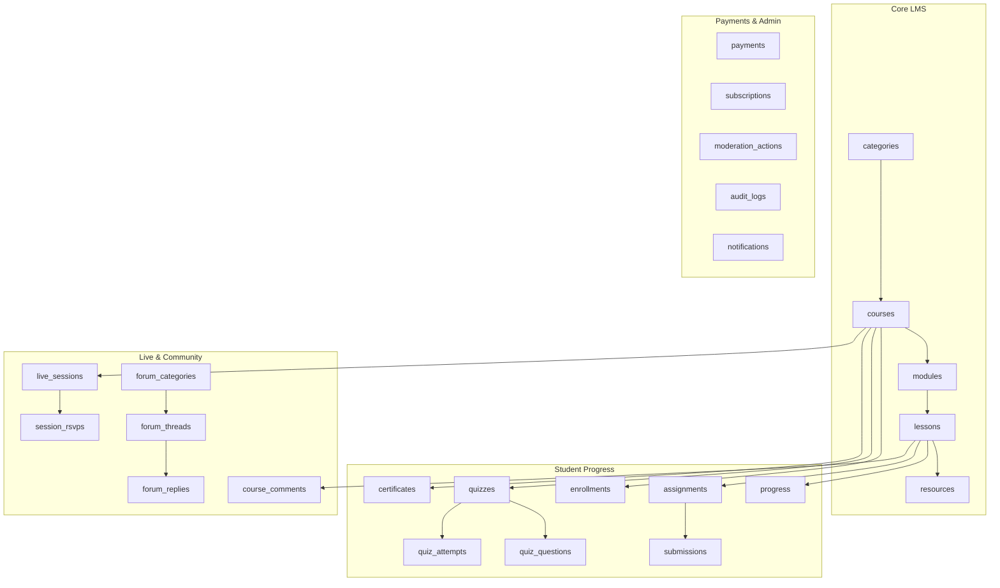

# amarbhaiya.in — Backend, Auth, Schema & RBAC Analysis

## 1. Installed Skills

Two Appwrite agent skills are pre-installed at `.agents/skills/`:

### `appwrite-cli` (539 lines)
Covers CLI tooling: `appwrite login`, `appwrite init project`, `appwrite push tables/functions/sites/buckets`, `appwrite generate` (type-safe SDK generation), and CI/CD non-interactive mode. 

**Key takeaway:** The CLI skill documents `appwrite generate --language typescript` which auto-generates typed database helpers from the live schema. This should be used **after** running the setup script to generate type-safe query wrappers instead of manually maintaining [appwrite.ts](file:///c:/Users/Gaurav/Desktop/AmarBhaiya.in/src/types/appwrite.ts).

### `appwrite-typescript` (707 lines)
Covers both client-side (`appwrite` package) and server-side (`node-appwrite` package) SDK patterns.

**Critical findings from the skill:**

| Topic | Skill Says | Codebase Status |
|-------|-----------|-----------------|
| **Database class** | Use `TablesDB` (not deprecated `Databases`) | ❌ Code uses `Databases` everywhere |
| **Calling style** | Prefer object-params `{ databaseId: '...' }` | ⚠️ Setup script uses positional args |
| **SSR Auth** | Cookie name **must** be `a_session_<PROJECT_ID>` | ❌ Code uses `amarbhaiya-session` |
| **Session client** | Create fresh per-request, never share | ✅ `createSessionClient()` does this |
| **Admin client** | Reusable singleton with API key | ⚠️ Creates new instance each call |
| **Realtime** | Use `Channel.tablesdb(...)` helpers | Not implemented yet |

---

## 2. Appwrite SDK Versions

| Package | Version | Notes |
|---------|---------|-------|
| `appwrite` (client) | 24.0.0 | Latest — has `TablesDB` class |
| `node-appwrite` (server) | 23.0.0 | Latest — has `TablesDB` class |

> [!WARNING]
> Both SDKs ship `TablesDB` alongside the deprecated `Databases`. The entire codebase currently uses the deprecated class. Migration is recommended.

---

## 3. Authentication Architecture

### Files

| File | Purpose |
|------|---------|
| [client.ts](file:///c:/Users/Gaurav/Desktop/AmarBhaiya.in/src/lib/appwrite/client.ts) | Browser-side Appwrite client (Realtime, client queries) |
| [server.ts](file:///c:/Users/Gaurav/Desktop/AmarBhaiya.in/src/lib/appwrite/server.ts) | `createSessionClient()` + `createAdminClient()` for SSR |
| [auth.ts](file:///c:/Users/Gaurav/Desktop/AmarBhaiya.in/src/lib/appwrite/auth.ts) | `getLoggedInUser()`, `requireAuth()`, `requireRole()`, `assignRole()` |
| [validators/auth.ts](file:///c:/Users/Gaurav/Desktop/AmarBhaiya.in/src/lib/validators/auth.ts) | Zod schemas for login, register, forgot-password |

### Auth Flow (Designed but NOT implemented)



### Critical Auth Issues

> [!CAUTION]
> **Session Cookie Name is WRONG.**
> 
> The skill explicitly states: *"Cookie name must be `a_session_<PROJECT_ID>`"*
> 
> Current code in [config.ts](file:///c:/Users/Gaurav/Desktop/AmarBhaiya.in/src/lib/appwrite/config.ts#L48): `sessionCookieName: "amarbhaiya-session"`
> 
> This will cause Appwrite to NOT recognize the session. Must be: `a_session_69cb8c11000b811e3363`

### Missing Auth Implementation

The following are defined in schemas but have **no actual route/action handlers**:

- [ ] Login form + server action (email/password session creation)
- [ ] Register form + server action (account creation + auto-login)
- [ ] Forgot password flow (recovery email + reset)
- [ ] OAuth2 (Google) login flow
- [ ] Logout action (delete session + clear cookie)
- [ ] Email verification flow
- [ ] `(auth)` route group (pages for `/login`, `/register`, `/forgot-password`)

---

## 4. Database Schema

### Overview

**1 Database:** `amarbhaiya_db`  
**24 Collections** defined in [setup-appwrite.mjs](file:///c:/Users/Gaurav/Desktop/AmarBhaiya.in/scripts/setup-appwrite.mjs):



### Collection Details

| # | Collection | Attrs | Permissions (Read / Write) |
|---|-----------|-------|---------------------------|
| 1 | `categories` | 5 | any / admin |
| 2 | `courses` | 17 | any / admin+instructor |
| 3 | `modules` | 4 | any / admin+instructor |
| 4 | `lessons` | 8 | any / admin+instructor |
| 5 | `resources` | 5 | users / admin+instructor |
| 6 | `enrollments` | 6 | users / admin |
| 7 | `progress` | 5 | users / users (create+update), admin (delete) |
| 8 | `quizzes` | 5 | users / admin+instructor |
| 9 | `quiz_questions` | 5 | users / admin+instructor |
| 10 | `quiz_attempts` | 5 | users / users (create), admin (update) |
| 11 | `assignments` | 5 | users / admin+instructor |
| 12 | `submissions` | 6 | users / users (create), admin+instructor (update) |
| 13 | `certificates` | 5 | any / admin |
| 14 | `live_sessions` | 9 | users / admin+instructor |
| 15 | `session_rsvps` | 3 | users / users |
| 16 | `course_comments` | 11 | users / users (create), admin+moderator (update+delete) |
| 17 | `forum_categories` | 6 | any / admin |
| 18 | `forum_threads` | 11 | users / users (create), admin+moderator (update+delete) |
| 19 | `forum_replies` | 7 | users / users (create), admin+moderator (update+delete) |
| 20 | `payments` | 8 | admin / admin |
| 21 | `subscriptions` | 6 | admin / admin |
| 22 | `moderation_actions` | 13 | admin+moderator / admin+moderator (create), admin (update) |
| 23 | `audit_logs` | 7 | admin / admin |
| 24 | `notifications` | 7 | users / admin (create+delete), users (update) |

### Schema Issues Found

> [!WARNING]
> **Type mismatches between schema and TypeScript interfaces:**
> 
> The [types/appwrite.ts](file:///c:/Users/Gaurav/Desktop/AmarBhaiya.in/src/types/appwrite.ts) file defines fields that **don't exist** in the setup script:
> - `Course.tags`, `Course.requirements`, `Course.whatYouLearn` — string arrays not created
> - `QuizQuestion.options` — string array not created  
> - `QuizAttempt.answers` — string array not created
> 
> The setup script has no `createStringArrayAttribute()` calls, so array fields will fail at runtime.

> [!NOTE]
> **No indexes defined.** The setup script creates 24 collections with attributes but zero indexes. Queries on `courseId`, `userId`, `lessonId`, `slug` etc. will do full table scans.

### Missing in Setup Script

- **No URL attributes** for fields like `shareUrl`, `recordingUrl` — using `createStringAttribute` instead of `createUrlAttribute`
- **No relationship attributes** — all foreign keys are manual string IDs with no referential integrity
- **No string array support** — array fields in TypeScript types won't work

---

## 5. RBAC Model

### Roles

Defined in [constants.ts](file:///c:/Users/Gaurav/Desktop/AmarBhaiya.in/src/lib/utils/constants.ts#L78-L87):

| Role | Appwrite Label | Permissions |
|------|---------------|-------------|
| `admin` | `admin` | Full CRUD on everything. Manage users, payments, audit logs |
| `instructor` | `instructor` | Create/update courses, modules, lessons, quizzes, assignments. No payment access |
| `moderator` | `moderator` | Manage comments, forum threads/replies, moderation actions. No course creation |
| `student` | `student` | Read courses, enroll, track progress, submit assignments, create comments |

### How RBAC Works

```
Appwrite Labels → getUserRole() → requireRole() → Page/Action Guard
```

1. **Appwrite assigns labels** via admin console or `users.updateLabels()`
2. [auth.ts:getUserRole()](file:///c:/Users/Gaurav/Desktop/AmarBhaiya.in/src/lib/appwrite/auth.ts#L36-L43) reads `user.labels[]` and returns the highest role
3. [auth.ts:requireRole()](file:///c:/Users/Gaurav/Desktop/AmarBhaiya.in/src/lib/appwrite/auth.ts#L57-L66) guards routes/actions by checking against allowed roles
4. [auth.ts:assignRole()](file:///c:/Users/Gaurav/Desktop/AmarBhaiya.in/src/lib/appwrite/auth.ts#L70-L83) strips old role labels and sets a new one

### Dashboard Navigation per Role

Each role gets a distinct sidebar defined in [constants.ts](file:///c:/Users/Gaurav/Desktop/AmarBhaiya.in/src/lib/utils/constants.ts#L37-L68):

- **Student** → `/app/dashboard`, `/app/courses`, `/app/community`, `/app/live`, `/app/profile`
- **Instructor** → `/instructor/*` (courses, students, live, community)  
- **Moderator** → `/moderator/*` (reports, students, community)
- **Admin** → `/admin/*` (users, courses, categories, payments, live, moderation, audit)

### RBAC Issues

> [!IMPORTANT]
> **Role priority logic is simplistic.** If a user has both `admin` and `instructor` labels, they get `admin`. This is correct, but there's no multi-role support — an admin can't also see the instructor dashboard.

> [!WARNING]
> **No middleware protection.** There's no Next.js middleware checking roles at the route level. The `requireRole()` function is a server-action guard only. Anyone can navigate to `/admin/*` URLs — they'd just get redirected inside the server component, but the route structure is exposed.

---

## 6. Storage Buckets

| Bucket | Max Size | Allowed Types | Permissions |
|--------|----------|--------------|-------------|
| `course_videos` | 500MB | mp4, webm, quicktime | users read / admin+instructor write |
| `course_thumbnails` | 5MB | jpeg, png, webp | any read / admin+instructor write |
| `course_resources` | 50MB | pdf, zip, text | users read / admin+instructor write |
| `user_avatars` | 2MB | jpeg, png, webp | any read / users CRUD |
| `certificates` | 10MB | png, jpeg, pdf | any read / admin write |
| `blog_images` | 10MB | jpeg, png, webp, gif | any read / admin write |

---

## 7. Zod Validators

| File | Schemas | Status |
|------|---------|--------|
| [validators/auth.ts](file:///c:/Users/Gaurav/Desktop/AmarBhaiya.in/src/lib/validators/auth.ts) | `loginSchema`, `registerSchema`, `forgotPasswordSchema` | ✅ Good — password requires letter+number, min 8 chars, consent required |
| [validators/course.ts](file:///c:/Users/Gaurav/Desktop/AmarBhaiya.in/src/lib/validators/course.ts) | `courseSchema`, `moduleSchema`, `lessonSchema`, `contactSchema` | ✅ Good — proper min/max validation |

---

## 8. Summary: Critical Action Items

### 🔴 Must Fix Before Auth Works

| # | Issue | File | Fix |
|---|-------|------|-----|
| 1 | **Wrong cookie name** | [config.ts:48](file:///c:/Users/Gaurav/Desktop/AmarBhaiya.in/src/lib/appwrite/config.ts#L48) | Change to `a_session_69cb8c11000b811e3363` |
| 2 | **Using deprecated `Databases`** | client.ts, server.ts, setup-appwrite.mjs | Migrate to `TablesDB` |
| 3 | **Missing array attributes** | setup-appwrite.mjs | Add `tags`, `requirements`, `whatYouLearn`, `options`, `answers` |
| 4 | **No database indexes** | setup-appwrite.mjs | Add indexes on `courseId`, `userId`, `slug`, `lessonId` |
| 5 | **Auth routes not built** | src/app/(auth)/ | Build login, register, forgot-password pages + server actions |

### 🟡 Should Improve

| # | Issue | Recommendation |
|---|-------|---------------|
| 6 | Admin client recreated each call | Make singleton or cache |
| 7 | No Next.js middleware | Add `middleware.ts` for route-level auth guards |
| 8 | No `appwrite generate` types | Run `appwrite generate` after DB setup for auto-typed helpers |
| 9 | Setup script uses positional args | Migrate to object-params style |
| 10 | `.env` exposes real API key | Add `.env` to `.gitignore` (verify) |
