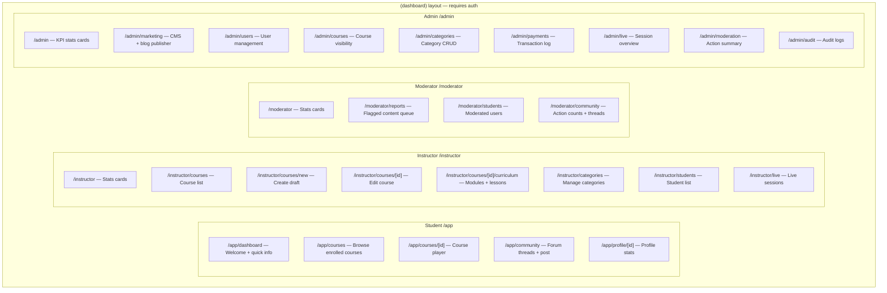

# Dashboard Deep-Dive: Current State, Ideal State & Community Subdomain

> Full audit of all 4 role dashboards (30 pages) against 27 skills, plus architectural proposal for `community.amarbhaiya.in`.

---

## Table of Contents

1. [Current Dashboard Inventory](#1-current-dashboard-inventory)
2. [Student Dashboard Audit](#2-student-dashboard)
3. [Instructor Dashboard Audit](#3-instructor-dashboard)
4. [Moderator Dashboard Audit](#4-moderator-dashboard)
5. [Admin Dashboard Audit](#5-admin-dashboard)
6. [Cross-Dashboard Issues](#6-cross-dashboard-issues)
7. [Community Subdomain Architecture](#7-community-subdomain)
8. [Recommended Roadmap](#8-recommended-roadmap)

---

## 1. Current Dashboard Inventory

### Route Map



### File Size Reality Check

| Location | Lines of Code | Assessment |
|----------|---------------|------------|
| `dashboard-data.ts` | **1,303** | 🔴 GOD FILE — needs splitting |
| `operations.ts` | **848** | 🔴 GOD FILE — needs splitting |
| All 30 page files combined | ~1,200 | ⚠️ Thin shells — most are just stat cards |

---

## 2. Student Dashboard

### Current Capabilities

| Page | What it Does Now | Assessment |
|------|-----------------|------------|
| `/app/dashboard` | Shows welcome, user ID, role, verification status, logout button | 🔴 **Useless** — displays debug info, not learning progress |
| `/app/courses` | Lists ALL published courses (not enrolled) | 🟠 **Wrong** — shows catalogue, not "My Courses" |
| `/app/courses/[id]` | Course player stub | ⚠️ Skeleton |
| `/app/community` | Forum threads + create form | ✅ Functional but basic |
| `/app/profile/[id]` | Streak, active courses, certificates | ✅ Good data model |

### What It SHOULD Do

```
/app/dashboard — Student Home
├── 📊 Learning Progress Overview
│   ├── Current streak (🔥 X days) — already have calculateCurrentStreak()
│   ├── Total completed lessons this week
│   ├── Overall completion % across all courses
│   └── Hours learned this month
│
├── 📚 Continue Learning (top 3 in-progress courses)
│   ├── Course title + thumbnail
│   ├── Progress bar with % 
│   ├── "Continue" → opens last uncompleted lesson
│   └── Time estimate to complete next lesson
│
├── 🎥 Upcoming Live Sessions
│   ├── Next 3 scheduled sessions
│   ├── Countdown timer
│   ├── RSVP status (Going / Not going)
│   └── "Join Now" button when session is live
│
├── 🏆 Achievements
│   ├── Certificates earned (clickable)
│   ├── Quizzes completed with scores
│   └── Badges (first course, streak milestones, etc.)
│
├── 📢 Announcements
│   ├── Platform announcements from admin
│   └── Course-specific announcements from instructor
│
└── 💬 Recent Community Activity
    ├── My recent posts + replies
    └── Trending threads this week
```

```
/app/courses — My Enrolled Courses (NOT catalogue)
├── Filter: All | In Progress | Completed
├── Sort: Recently accessed | % complete | Title
├── Course cards with:
│   ├── Thumbnail
│   ├── Progress bar
│   ├── Last accessed date
│   ├── Next lesson title
│   └── "Continue" | "Review" CTA
└── Empty state: "Browse courses" → /courses
```

```
/app/courses/[id] — Course Player
├── Video player (HTML5 + custom controls)
├── Lesson sidebar (collapsible on mobile)
│   ├── Module expand/collapse
│   ├── Lesson checkmarks
│   └── Current lesson highlight
├── Tabs: Content | Resources | Notes | Q&A
├── Progress tracking: auto-mark + manual
├── Keyboard shortcuts (spacebar = play/pause, N = next)
└── Mobile: swipe between tabs
```

### Skill Violations in Student Dashboard

| Issue | Skill | Severity |
|-------|-------|----------|
| `space-y-8` used instead of `gap-8` | `shadcn` | 🟠 High |
| No loading skeletons | `cc-skill-frontend-patterns` | 🔴 Critical |
| Logout button on main dashboard (should be in header dropdown) | `ui-ux-pro-max` | 🟠 High |
| No error boundaries | `cc-skill-frontend-patterns` | 🔴 Critical |
| Student courses page shows catalogue not enrolled courses | Logic bug | 🔴 Critical |
| Dashboard shows debug info (User ID, raw role) | `ui-ux-pro-max` | 🔴 Critical |
| No `loading.tsx` for any student route | `web-performance` | 🟠 High |
| Community thread links are not clickable (no thread detail page) | `ui-ux-pro-max` | 🟠 High |

---

## 3. Instructor Dashboard

### Current Capabilities

| Page | What it Does Now | Assessment |
|------|-----------------|------------|
| `/instructor` | 4 stat cards (courses, enrollments, sessions, reviews) | ⚠️ Minimal but data-backed |
| `/instructor/courses` | Course list with title, description, status | ✅ Functional |
| `/instructor/courses/new` | Create draft form (title, category, access, description) | ⚠️ Not a wizard — single step |
| `/instructor/courses/[id]` | Edit course form | ✅ Functional |
| `/instructor/courses/[id]/curriculum` | Module + lesson CRUD forms | ✅ Core feature works |
| `/instructor/categories` | Category CRUD | ✅ Functional |
| `/instructor/students` | Enrolled students with progress % | ✅ Good |
| `/instructor/live` | Live session list with RSVP counts | ✅ Functional |

### What It SHOULD Do

```
/instructor — Instructor Command Center
├── 📊 Performance Snapshot
│   ├── Total students across all courses
│   ├── Average completion rate
│   ├── Revenue this month (if paid courses)
│   ├── Average rating
│   └── Engagement trend (up/down arrow vs last month)
│
├── 📋 Action Items (priority queue)
│   ├── X assignments pending review
│   ├── X student questions unanswered
│   ├── X courses in draft status
│   └── Next scheduled live session (countdown)
│
├── 📚 Course Performance Cards
│   ├── Title + enrollment count
│   ├── Avg completion % + trend
│   ├── Recent enrollments (last 7 days)
│   └── Quick actions: Edit | View | Analytics
│
├── 💬 Recent Student Activity
│   ├── New comments on your courses
│   ├── New community questions mentioning you
│   └── Recent quiz completions with scores
│
└── 📅 Upcoming Schedule
    ├── Live sessions you're hosting
    ├── Assignment review deadlines
    └── Scheduled course publish dates
```

```
/instructor/courses/new — Course Creation Wizard (Multi-Step)
├── Step 1: Basic Info (title, category, access model)
├── Step 2: Description + objectives (what you'll learn)
├── Step 3: Curriculum outline (modules → lessons)
├── Step 4: Pricing + settings
├── Step 5: Review + draft/publish
├── Progress indicator across top
├── Auto-save between steps
└── Back/Next navigation
```

### Skill Violations in Instructor Dashboard

| Issue | Skill | Severity |
|-------|-------|----------|
| "Course Creation Wizard" is a single form, not a wizard | `ui-ux-pro-max §8` | 🟠 High |
| No auto-save on curriculum editor | `ui-ux-pro-max §8` | 🟠 High |
| Raw HTML forms — no shadcn Input/Select/Textarea components | `shadcn` | 🔴 Critical |
| No file upload UI for video/thumbnails | Missing feature | 🔴 Critical |
| No course analytics (view counts, completion rates) | Missing feature | 🟠 High |
| No draft preview ("View as student") | `ui-ux-pro-max` | 🟠 High |
| `space-y-*` pattern throughout | `shadcn` | 🟠 High |
| No confirmation before publish/unpublish | `ui-ux-pro-max §8` | 🟠 High |

---

## 4. Moderator Dashboard

### Current Capabilities

| Page | What it Does Now | Assessment |
|------|-----------------|------------|
| `/moderator` | 4 stat cards (reports, muted, flagged, actions today) | ⚠️ Minimal |
| `/moderator/reports` | Flagged content queue with action forms | ✅ Functional + interactive |
| `/moderator/students` | Moderated users with latest action | ✅ Functional |
| `/moderator/community` | Action counts + recent threads | ✅ Functional |

### What It SHOULD Do

```
/moderator — Moderation Command Center
├── 🚨 Urgent Queue
│   ├── Reports pending > 24h (red highlight)
│   ├── Active escalations to admin
│   ├── Users currently timed-out (with expiry countdown)
│   └── Quick stats: avg response time today
│
├── 📈 Activity Feed (real-time)
│   ├── New reports as they come in
│   ├── Other moderator actions (to avoid duplicates)
│   ├── Auto-moderation triggers (if implemented)
│   └── System alerts (spam detection, flood)
│
├── 🔍 Quick Search
│   ├── Search user by name/email
│   ├── Search thread by title/ID
│   └── Search by moderation action ID
│
├── 📊 My Moderation Stats
│   ├── Actions taken today / this week / this month
│   ├── Breakdown by type (warn, mute, timeout, delete)
│   └── Average resolution time
│
└── 📋 Recent Activity Log
    ├── Last 20 moderation actions (all moderators)
    └── Clickable → links to the entity
```

### Skill Violations in Moderator Dashboard

| Issue | Skill | Severity |
|-------|-------|----------|
| No confirmation dialog before destructive actions | `ui-ux-pro-max §8` | 🔴 Critical |
| No undo for moderation actions | `ui-ux-pro-max §8` | 🟠 High |
| Report IDs shown as raw strings (not human-readable) | `ui-ux-pro-max` | 🟠 High |
| No real-time updates (would benefit from Appwrite Realtime) | `appwrite-typescript` | 🟡 Medium |
| No keyboard shortcuts for rapid moderation | `ui-ux-pro-max §3` | 🟡 Medium |
| No search/filter on reports or students | `ui-ux-pro-max` | 🟠 High |
| No indication of other moderators' actions (collision risk) | `ui-ux-pro-max` | 🟠 High |

---

## 5. Admin Dashboard

### Current Capabilities

| Page | What it Does Now | Assessment |
|------|-----------------|------------|
| `/admin` | 4 stat cards (users, enrollments, revenue, sessions) | ⚠️ Minimal |
| `/admin/marketing` | CMS forms for site copy + blog posts | ✅ Functional |
| `/admin/users` | User list with name, email, role, status | ⚠️ No actions (view-only) |
| `/admin/courses` | Course list with visibility controls | ⚠️ Basic |
| `/admin/categories` | Category CRUD forms | ✅ Functional |
| `/admin/payments` | Transaction log | ⚠️ View-only, no exports |
| `/admin/live` | Session overview | ⚠️ View-only |
| `/admin/moderation` | Summary stats | ⚠️ Minimal |
| `/admin/audit` | Audit log list | ⚠️ View-only, no filters |

### What It SHOULD Do

```
/admin — Platform Control Center
├── 📊 KPI Dashboard
│   ├── Revenue: today / this week / this month / all-time
│   ├── Users: new today / total / growth trend
│   ├── Enrollments: new today / active / completion rate
│   ├── Live Sessions: active now / scheduled next 7 days
│   └── Platform Health: API response time, error rate
│
├── 📈 Charts & Trends
│   ├── Revenue over time (line chart, last 30 days)
│   ├── New signups over time (bar chart, last 30 days)
│   ├── Top courses by enrollment (horizontal bar)
│   └── Revenue by payment method (pie chart)
│
├── 🚨 Alerts & Issues
│   ├── Failed payments needing attention
│   ├── Moderator escalations awaiting admin
│   ├── Courses with 0 enrollments after 30 days
│   └── Storage approaching quota
│
├── 🏃 Quick Actions
│   ├── Create announcement
│   ├── Feature/unfeature a course
│   ├── Bulk assign roles
│   └── Export revenue report
│
└── 🔄 Real-time Activity Feed
    ├── New registrations
    ├── New purchases
    ├── Live sessions starting
    └── Moderation actions
```

```
/admin/users — Full User Management
├── DataTable with:
│   ├── Search by name/email
│   ├── Filter by role, status, join date range
│   ├── Sort by any column
│   └── Pagination (not 80-user hard limit)
├── Row actions:
│   ├── View profile
│   ├── Change role (dropdown)
│   ├── Suspend / reactivate
│   ├── Delete (with confirmation dialog)
│   └── Send notification
└── Bulk actions:
    ├── Assign role to selected
    └── Export as CSV
```

```
/admin/payments — Financial Dashboard
├── Revenue summary cards (today, week, month, all-time)
├── DataTable with:
│   ├── Search by user/course
│   ├── Filter by method, status, date range
│   ├── Sort by any column
│   └── Pagination
├── Row actions:
│   ├── View details
│   ├── Issue refund (with confirmation)
│   └── Resend receipt
└── Export: CSV download of filtered results
```

### Skill Violations in Admin Dashboard

| Issue | Skill | Severity |
|-------|-------|----------|
| No charts or visualizations | `ui-ux-pro-max §10` | 🔴 Critical |
| Users page is view-only — no role change, suspend, delete | Missing core feature | 🔴 Critical |
| No DataTable component (no search, filter, sort, pagination) | `shadcn-ui` (TanStack Table) | 🔴 Critical |
| Payments page has no export functionality | Missing feature | 🟠 High |
| Audit logs have no filters or search | Missing feature | 🟠 High |
| Marketing CMS has no preview | `ui-ux-pro-max` | 🟠 High |
| No alert/notification system for admin | Missing feature | 🟠 High |
| Raw HTML forms throughout — no shadcn components | `shadcn` | 🔴 Critical |
| No breadcrumb navigation | `ui-ux-pro-max §4` | 🟡 Medium |

---

## 6. Cross-Dashboard Issues

### Code Architecture

| Issue | Impact | Skill |
|-------|--------|-------|
| `dashboard-data.ts` is 1,303 lines — **god file** | Maintainability nightmare | `clean-code` — max 200-300 lines/file |
| `operations.ts` is 848 lines — **god file** | Same | `clean-code` |
| Every page uses raw `<article className="border border-border p-5">` | No reusable card component | `cc-skill-frontend-patterns` |
| All forms use raw `<input>`, `<select>`, `<textarea>` — no shadcn | Inconsistent, inaccessible | `shadcn`, `shadcn-ui` |
| `space-y-*` used instead of `gap-*` everywhere | `shadcn` strict rule violation | `shadcn` |
| No `loading.tsx` in ANY dashboard route | No loading states, poor CWV | `web-performance` |
| No `error.tsx` in dashboard routes | Unhandled errors crash page | `cc-skill-frontend-patterns` |
| Every stat card is inline HTML — no reusable `<StatCard>` component | DRY violation | `clean-code` |
| Forms have no client-side validation feedback | Poor UX | `shadcn-ui` (FormMessage) |
| No toast notifications after form submissions | No feedback loop | `shadcn` (sonner) |

### UI/UX Issues

| Issue | Impact | Skill |
|-------|--------|-------|
| All pages look identical — same stat card layout, same border style | No visual hierarchy | `frontend-design`, `ui-ux-pro-max` |
| No empty state illustrations | Feels broken when empty | `ui-ux-pro-max §8` |
| No hover effects on interactive elements | Feels static | `antigravity-design-expert` |
| No keyboard navigation support | Accessibility | `ui-ux-pro-max §1` |
| Touch targets below 44pt on mobile | Accessibility | `ui-ux-pro-max §2` |
| No breadcrumbs in nested routes | Navigation confusion | `ui-ux-pro-max §4` |
| Console-like monospace font for data | Not professional | `frontend-design` |

### Missing Features Across All Dashboards

| Feature | Which Dashboards | Priority |
|---------|-----------------|----------|
| Search / global filter | All | 🔴 Critical |
| Pagination | Admin, Moderator | 🔴 Critical |
| DataTable with sorting | Admin users/payments/audit | 🔴 Critical |
| Toast notifications | All | 🟠 High |
| Loading states (Skeleton) | All | 🟠 High |
| Error boundaries | All | 🟠 High |
| Empty state with CTA | All | 🟠 High |
| Breadcrumb navigation | Instructor, Admin (nested routes) | 🟡 Medium |
| Keyboard shortcuts | Moderator (rapid actions) | 🟡 Medium |
| Real-time updates | Moderator, Admin | 🟡 Medium |
| Export to CSV | Admin (payments, users) | 🟡 Medium |
| Bulk actions | Admin (users, courses) | 🟡 Medium |

---

## 7. Community Subdomain: `community.amarbhaiya.in`

### Current State

The community section is currently at `/app/community` — a page inside the student dashboard. It:
- Shows forum threads from Appwrite
- Allows creating new threads
- Has moderation support via `/moderator/community`

### Why a Subdomain?

| Reason | Benefit |
|--------|---------|
| **SEO** | Separate domain authority, dedicated sitemap |
| **Identity** | Community feels like its own product, not buried in a dashboard |
| **Access** | Can have its own public-facing pages (browse without login) |
| **Performance** | Separate routing tree, no dashboard layout overhead |
| **Scalability** | Can be evolved independently (add notifications, DMs, gamification) |

### Architecture: Single Next.js App with Hostname Routing

Next.js supports **middleware-based hostname routing** — one codebase, multiple subdomains. No separate deployment needed.

```
amarbhaiya.in              → (marketing) routes
community.amarbhaiya.in    → (community) routes  ← NEW
amarbhaiya.in/app/*        → (dashboard) student routes
amarbhaiya.in/admin/*      → (dashboard) admin routes
...
```

#### Implementation Approach

**Step 1: Create `(community)` route group**

```
src/app/(community)/
├── layout.tsx              # Community-specific layout (own navbar, sidebar)
├── page.tsx                # Community home — trending threads, categories
├── c/
│   └── [category]/
│       └── page.tsx        # Category view — threads in this category
├── thread/
│   └── [id]/
│       └── page.tsx        # Thread detail — replies, reactions
├── new/
│   └── page.tsx            # Create new thread
├── search/
│   └── page.tsx            # Search threads
└── members/
    └── page.tsx            # Community members directory
```

**Step 2: Add hostname routing in `middleware.ts`**

```typescript
import { NextRequest, NextResponse } from 'next/server';

export function middleware(request: NextRequest) {
  const hostname = request.headers.get('host') || '';
  const pathname = request.nextUrl.pathname;
  
  // Route community.amarbhaiya.in to (community) route group
  if (hostname.startsWith('community.')) {
    // Rewrite to (community) route group
    return NextResponse.rewrite(
      new URL(`/community${pathname}`, request.url)
    );
  }
  
  return NextResponse.next();
}

export const config = {
  matcher: ['/((?!api|_next|static|favicon.ico).*)'],
};
```

**Step 3: Internal rewrite route**

```
src/app/community/         # Internal rewrite target
├── [...slug]/page.tsx      # Catch-all that maps to (community) pages
```

**Step 4: Update `next.config.ts`**

```typescript
const nextConfig: NextConfig = {
  async rewrites() {
    return {
      beforeFiles: [
        // Map community subdomain paths
        {
          source: '/:path*',
          has: [{ type: 'host', value: 'community.amarbhaiya.in' }],
          destination: '/community/:path*',
        },
      ],
    };
  },
};
```

### Community Feature Spec

```
community.amarbhaiya.in
├── 🏠 Home
│   ├── Trending threads (most replies in 7 days)
│   ├── Latest threads (chronological)  
│   ├── Category sidebar/tabs
│   ├── Pinned announcements
│   └── "Ask a Question" CTA
│
├── 📁 Categories (/c/[category])
│   ├── Tech Help
│   ├── Career Advice
│   ├── Fitness Talk
│   ├── Course Discussions
│   ├── General Chat
│   └── Announcements (admin-only posting)
│
├── 💬 Thread Detail (/thread/[id])
│   ├── Original post with rich text
│   ├── Threaded replies (2 levels)
│   ├── Author info + role badge
│   ├── Reactions (👍 ❤️ 🎉 🤔)
│   ├── Reply form
│   ├── Share button (copy link)
│   └── Flag for moderation
│
├── ✏️ Create Thread (/new)
│   ├── Category selector
│   ├── Title field
│   ├── Rich text editor (markdown support)
│   ├── Tags (optional)
│   └── Preview before post
│
├── 🔍 Search (/search)
│   ├── Full-text search across threads + replies
│   ├── Filter by category, author, date range
│   └── Sort by relevance, date, replies
│
├── 👥 Members (/members)
│   ├── Leaderboard (most helpful, most posts)
│   ├── Role badges visible
│   └── Link to user profile on main site
│
└── 🔐 Auth
    ├── Uses same Appwrite session cookie
    ├── SSR auth via createSessionClient()
    ├── Guest access: can browse, must login to post
    └── Moderation: moderator tools visible for authorized roles
```

### DNS Setup

```
# Add CNAME in DNS provider
community.amarbhaiya.in  →  CNAME  →  amarbhaiya.in (or Vercel alias)

# In Vercel: add community.amarbhaiya.in as a custom domain
```

---

## 8. Recommended Roadmap

### Phase 1: Foundation (Do First)

| # | Task | Priority |
|---|------|----------|
| 1 | **Split `dashboard-data.ts`** into: `student-data.ts`, `instructor-data.ts`, `moderator-data.ts`, `admin-data.ts`, `community-data.ts` | 🔴 |
| 2 | **Split `operations.ts`** into: `admin-actions.ts`, `instructor-actions.ts`, `moderator-actions.ts`, `marketing-actions.ts` | 🔴 |
| 3 | **Create reusable components**: `<StatCard>`, `<DataTable>`, `<EmptyState>`, `<PageHeader>`, `<FormField>` | 🔴 |
| 4 | **Add `loading.tsx`** to every dashboard route group | 🔴 |
| 5 | **Add `error.tsx`** to every dashboard route group | 🔴 |
| 6 | **Replace `space-y-*`** with `gap-*` across all pages | 🟠 |
| 7 | **Replace raw HTML forms** with shadcn Input/Select/Textarea | 🟠 |
| 8 | **Add sonner toasts** for form submission feedback | 🟠 |

### Phase 2: Student Dashboard Rebuild

| # | Task |
|---|------|
| 1 | Rebuild `/app/dashboard` with learning progress, continue learning, live sessions, achievements |
| 2 | Fix `/app/courses` to show ENROLLED courses with progress bars (not catalogue) |
| 3 | Remove debug info (User ID, raw role) from dashboard |
| 4 | Move logout to header dropdown (it's already in DashboardHeader) |
| 5 | Add progress visualization (circular % or animated bar) |

### Phase 3: Admin Dashboard Enhancement

| # | Task |
|---|------|
| 1 | Add DataTable to users page with search, filter, role dropdown, suspend |
| 2 | Add DataTable to payments with export CSV |
| 3 | Add DataTable to audit logs with search/filter |
| 4 | Add charts (revenue trend, user growth) to admin dashboard |
| 5 | Add alert cards for failed payments, escalations |

### Phase 4: Instructor Dashboard Enhancement

| # | Task |
|---|------|
| 1 | Convert course creation to multi-step wizard |
| 2 | Add file upload for video/thumbnails |
| 3 | Add course analytics (enrollment, completion rate, ratings) |
| 4 | Add "Preview as student" button |
| 5 | Add confirmation dialogs for publish/unpublish |

### Phase 5: Moderator Dashboard Enhancement

| # | Task |
|---|------|
| 1 | Add confirmation dialogs before all destructive actions |
| 2 | Add search/filter to reports and students pages |
| 3 | Add real-time updates via Appwrite Realtime |
| 4 | Add keyboard shortcuts for rapid moderation |
| 5 | Show other moderators' concurrent actions |

### Phase 6: Community Subdomain

| # | Task |
|---|------|
| 1 | Create `(community)` route group with layout |
| 2 | Add middleware hostname routing |
| 3 | Create category pages, thread detail, search |
| 4 | Add rich text support (markdown) |
| 5 | Add reactions, share, flag |
| 6 | Configure DNS + Vercel for subdomain |
| 7 | Remove community from student dashboard sidebar (replace with link to subdomain) |
