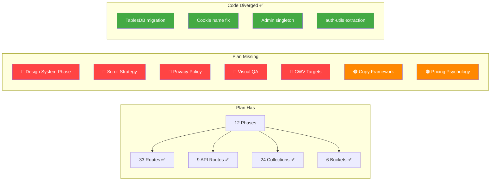

# Implementation Plan vs. Skills — Gap Analysis

> Cross-referencing the **12-phase implementation plan** (`implementation_plan.md`) against the **27 acquired skills** to identify violations, gaps, and opportunities.

---

## Executive Summary

| Metric | Count |
|--------|-------|
| Total plan phases | 12 |
| Phases with skill violations | **10 of 12** |
| Critical violations (blocks launch) | **8** |
| High violations (degrades quality) | **9** |
| Medium violations (missed opportunity) | **6** |
| Already fixed in codebase | **3** |

### What's Already Fixed ✅

The **codebase** has diverged from the **plan** in a good way — previous sessions fixed:

1. ✅ `server.ts` uses `TablesDB` (plan still shows `Databases`)
2. ✅ Cookie name is `a_session_${PROJECT_ID}` (plan shows `amarbhaiya-session`)
3. ✅ Admin client uses singleton pattern (plan creates new instance each call)
4. ✅ `getUserRole` extracted to `auth-utils.ts` as a pure function (plan had it inline and potentially non-async in server action file)

### What's Still Wrong ❌

The plan code samples and implementation guidance **still contain patterns that violate skill standards**. These need to be corrected both in the plan and the actual codebase.

---

## Phase-by-Phase Audit

### Phase 1 — Foundation & Dependencies

| Aspect | Plan Says | Skill Says | Verdict |
|--------|-----------|------------|---------|
| UI Libraries | "HeroUI, Shadcn, MagicUI, SkiperUI" | **shadcn skill**: Use existing components first, consistent styling | ⚠️ Too many libraries — pick ONE base (shadcn) + layer selectively |
| Fonts | Inter + Outfit | **frontend-design**: "Avoid generic AI aesthetics... commit to distinctive fonts (not Inter/Roboto)" | ❌ **VIOLATION** — Inter is the most generic AI font. Consider: Plus Jakarta Sans, Satoshi, or General Sans |
| Design tokens | "Custom colors, spacing, shadows" | **ui-ux-pro-max §6**: Semantic color tokens, not raw hex. **shadcn**: `bg-primary`, not `bg-blue-500` | ⚠️ Plan doesn't mention semantic token system |
| Animation | "fadeIn, slideUp, scaleIn, shimmer" | **ui-ux-pro-max §7**: Duration 150-300ms, `prefers-reduced-motion` support | ❌ **MISSING** — Plan has no mention of reduced-motion support |
| Component creation | "Build Shadcn CLI or manual" | **shadcn skill**: Always run `npx shadcn@latest info` first, check `isRSC`, use `gap-*` not `space-y-*` | ⚠️ Plan doesn't reference shadcn CLI workflow |

**Skills to apply**: `shadcn`, `frontend-design`, `ui-ux-pro-max`, `antigravity-design-expert`

---

### Phase 2 — Appwrite SDK Integration

| Aspect | Plan Says | Skill Says | Verdict |
|--------|-----------|------------|---------|
| Database class | `new Databases(client)` (line 303) | **appwrite-typescript**: Use `TablesDB`, `Databases` is deprecated | ❌ **CRITICAL** — Plan code is wrong (codebase already fixed) |
| Cookie name | `"amarbhaiya-session"` (line 311) | **appwrite-typescript**: Must be `a_session_<PROJECT_ID>` | ❌ **CRITICAL** — Plan code is wrong (codebase already fixed) |
| Admin client | Creates new each call (line 326) | **appwrite-typescript**: Admin client can be singleton | ❌ Plan code is suboptimal (codebase already fixed) |
| Calling style | Positional args | **appwrite-typescript**: Prefer object-params `{ databaseId }` | ⚠️ Plan samples use positional style |
| Realtime | "browser-side client for realtime" | **appwrite-typescript**: Use `Channel.tablesdb()` helpers | ❌ **MISSING** — No guidance on realtime patterns |
| Error handling | `catch { return null; }` | **clean-code**: Catch should log or rethrow meaningful errors | ⚠️ Silent swallow in `getLoggedInUser` |

**Skills to apply**: `appwrite-typescript`, `appwrite-cli`, `clean-code`

---

### Phase 3 — Authentication System

| Aspect | Plan Says | Skill Says | Verdict |
|--------|-----------|------------|---------|
| Form layout | "email/password fields, validation errors" | **shadcn §Forms**: Must use `FieldGroup` + `Field`, not raw `div` + `space-y-*` | ❌ **VIOLATION** — Plan shows no FieldGroup pattern |
| Form validation | Zod schemas | **shadcn-ui**: Use `Form`, `FormField`, `FormItem`, `FormLabel`, `FormMessage` together | ⚠️ Plan doesn't mention shadcn Form component composition |
| OAuth buttons | "Google sign-in button" | **shadcn §Icons**: Use `data-icon` on icons inside buttons, no sizing classes | ⚠️ No icon pattern guidance |
| RBAC middleware | "No traditional middleware" | **production-code-audit §Security**: Route-level access control, OWASP compliance | ❌ **CRITICAL** — Admin URLs are exposed even if content redirects |
| Consent checkbox | "DPDP" mentioned | **privacy-policy**: Need full privacy policy draft covering GDPR/CCPA/DPDP | ⚠️ Consent checkbox alone is insufficient |
| Password security | Min 8, letter+number | **production-code-audit**: OWASP password requirements, bcrypt, rate limiting | ⚠️ No rate limiting or brute-force protection mentioned |

**Skills to apply**: `shadcn`, `shadcn-ui`, `privacy-policy`, `production-code-audit`

---

### Phase 4 — Public Site & Landing Page

| Aspect | Plan Says | Skill Says | Verdict |
|--------|-----------|------------|---------|
| Scroll experience | 11 sections, no scroll strategy | **scroll-experience**: Story beats (Hook→Context→Journey→Climax→CTA), ScrollTrigger, parallax | ❌ **MAJOR GAP** — No scroll storytelling |
| Hero section | "photo/video, tagline, CTA buttons" | **antigravity-design-expert**: Floating elements, glassmorphism, spatial depth, GSAP motion | ⚠️ Plan describes generic hero, not premium |
| Glassmorphic navbar | Mentioned but no spec | **antigravity-design-expert**: `backdrop-blur`, border-opacity, `will-change: transform` | ⚠️ No implementation guidance |
| Course cards | Grid + filters | **cc-skill-frontend-patterns**: Compound components, composition, virtualization for 50+ items | ⚠️ No virtualization for large catalogues |
| SEO | "`metadata` exports" | **web-performance-optimization**: Semantic HTML, heading hierarchy, OG images, sitemap | ⚠️ Plan mentions SEO only in Phase 12, not Phase 4 |
| Image optimization | No mention in Phase 4 | **web-performance-optimization**: WebP/AVIF, `fetchpriority="high"` for hero, lazy load below-fold | ❌ **MISSING** — Performance should start in Phase 4 |
| Copy quality | No copy strategy | **copywriting**: Context gathering → Copy Brief Lock → No fabricated claims | ❌ **MISSING** — No copy framework for landing page |

**Skills to apply**: `scroll-experience`, `antigravity-design-expert`, `copywriting`, `marketing-psychology`, `web-performance-optimization`

---

### Phase 5 — LMS Core: Course Player & Enrollment

| Aspect | Plan Says | Skill Says | Verdict |
|--------|-----------|------------|---------|
| Video player | "HTML5 video, custom controls" | **ui-ux-pro-max §2**: Touch targets ≥44pt, tap feedback, gesture conflict prevention | ⚠️ No touch-target or accessibility guidance |
| Progress bar | Component listed | **ui-ux-pro-max §7**: Animation 150-300ms, spring physics, interruptible | ⚠️ No animation spec |
| Data fetching | Server actions | **cc-skill-frontend-patterns**: Error boundaries per route, Suspense, loading.tsx | ⚠️ No error boundary strategy |
| Comments | "Threaded replies" | **shadcn**: Use `Separator`, `Badge` for role badges, `Skeleton` for loading | ⚠️ No component composition guidance |
| Tab navigation | "Content \| Resources \| Notes \| Quiz" | **shadcn §Composition**: `TabsTrigger` must be inside `TabsList` | ⚠️ Not specified |

**Skills to apply**: `cc-skill-frontend-patterns`, `shadcn`, `ui-ux-pro-max`

---

### Phase 6 — Admin Panel

| Aspect | Plan Says | Skill Says | Verdict |
|--------|-----------|------------|---------|
| Data tables | "DataTable with users" | **shadcn-ui**: Use `@tanstack/react-table` with proper column defs, Checkbox for selection | ⚠️ No TanStack table reference |
| Charts | "User growth chart" | **ui-ux-pro-max §10**: Legends, tooltips, accessible colors, not just color to convey meaning | ⚠️ No chart accessibility spec |
| Toasts | "Alert system" | **shadcn**: Use `sonner` for toasts, not custom. Auto-dismiss 3-5s | ⚠️ No toast library specified |
| Audit logs | "Searchable, filterable" | **production-code-audit**: Audit logging for all sensitive actions, immutable records | ✅ Good — plan matches skill |
| Drag-and-drop | "Category reorder" | **ui-ux-pro-max §2**: Drag threshold to avoid accidental drags, gesture alternatives | ⚠️ No accessibility alternative for D&D |

**Skills to apply**: `shadcn-ui`, `ui-ux-pro-max`, `production-code-audit`

---

### Phase 7 — Instructor & Moderator Panels

| Aspect | Plan Says | Skill Says | Verdict |
|--------|-----------|------------|---------|
| Course wizard | "Create course wizard" | **ui-ux-pro-max §8**: Multi-step progress indicator, back navigation, form autosave | ❌ **MISSING** — No autosave or progress indicator spec |
| File upload | "Upload video, attach resources" | **web-performance-optimization**: Image/video optimization, 500MB max | ⚠️ No upload UX guidance (progress, retry, cancel) |
| Moderation actions | Well-specified | **ui-ux-pro-max §8**: Confirmation dialogs before destructive actions, undo support | ⚠️ No undo for moderation |

**Skills to apply**: `ui-ux-pro-max`, `clean-code`

---

### Phase 8 — Payments: Razorpay + PhonePe

| Aspect | Plan Says | Skill Says | Verdict |
|--------|-----------|------------|---------|
| Webhook security | "Verify signature" | **production-code-audit**: HMAC verification, replay attack prevention, idempotency | ⚠️ No idempotency key or replay protection mentioned |
| Error handling | Generic webhook handler | **clean-code**: Meaningful error messages, retry-safe operations | ⚠️ No error recovery strategy |
| Payment UX | "Processing states" | **ui-ux-pro-max §8**: Loading buttons, error feedback, success feedback | ⚠️ No detailed UX spec |
| Pricing page | Not in plan | **marketing-psychology**: Anchoring, decoy effect, loss aversion framing | ❌ **MISSING** — No pricing page design |

**Skills to apply**: `production-code-audit`, `marketing-psychology`, `ui-ux-pro-max`

---

### Phase 9 — Live Classes: Stream Video + Chat

| Aspect | Plan Says | Skill Says | Verdict |
|--------|-----------|------------|---------|
| Stream setup | Basic token + viewer | No specific Stream skill, but **clean-code** + **senior-architect** apply | ⚠️ No architecture for reconnection/error handling |
| Chat moderation | "Moderators can remove users" | **ui-ux-pro-max §8**: Confirmation dialogs, undo support | ⚠️ No undo for chat removal |

### Phase 10 — Community & Forums

| Aspect | Plan Says | Skill Says | Verdict |
|--------|-----------|------------|---------|
| Forum layout | "GitHub Discussions style" | **ui-ux-pro-max §5**: Mobile-first, readable line length (60-75 chars) | ⚠️ No mobile-first design spec |
| Rich text | "Threaded replies" | **shadcn**: Use `Separator`, `Badge`, `Avatar` with `AvatarFallback` | ⚠️ No component composition spec |

### Phase 11 — Assessments, Certificates & Email

| Aspect | Plan Says | Skill Says | Verdict |
|--------|-----------|------------|---------|
| Quiz UX | "MCQ, True/False, Short Answer" | **ui-ux-pro-max §8**: Progressive disclosure, inline validation, focus management | ⚠️ No timer UX or accessibility spec |
| Certificate | "Auto-generated, shareable" | **content-marketing**: Content as growth lever, evergreen assets | ⚠️ No social sharing optimization |

### Phase 12 — Polish, QA & Launch

| Aspect | Plan Says | Skill Says | Verdict |
|--------|-----------|------------|---------|
| Security checklist | 8 items | **production-code-audit**: Full OWASP Top 10, dependency analysis, secret scanning | ❌ **INCOMPLETE** — Missing XSS, CSRF, SSRF, dependency audit |
| Performance | "Image optimization, code splitting, skeletons" | **web-performance-optimization**: LCP < 2.5s, FID < 100ms, CLS < 0.1, bundle < 200KB gzip | ❌ **MISSING** — No specific metric targets |
| SEO | "metadata, OG, sitemap, robots" | **web-performance-optimization**: Core Web Vitals impact SEO ranking | ⚠️ Not linked to CWV targets |
| Visual QA | Not mentioned | **ui-visual-validator**: Systematic visual audit, cross-browser, dark mode parity | ❌ **MISSING** — No visual QA phase |
| Privacy policy | Not in any phase | **privacy-policy**: GDPR, CCPA, DPDP, data mapping, cookie policy | ❌ **CRITICAL MISSING** — Legal requirement for launch |
| Copy review | Not mentioned | **copy-editing**: Seven Sweeps Framework before launch | ❌ **MISSING** — No copy review process |

**Skills to apply**: `production-code-audit`, `web-performance-optimization`, `ui-visual-validator`, `privacy-policy`, `copy-editing`

---

## Violations Summary

### 🔴 Critical (Must Fix)

| # | Violation | Plan Location | Skill | Status |
|---|-----------|--------------|-------|--------|
| 1 | `Databases` class in plan code | Phase 2, line 303 | `appwrite-typescript` | ✅ Fixed in code, ❌ Plan outdated |
| 2 | Wrong cookie name in plan code | Phase 2, line 311 | `appwrite-typescript` | ✅ Fixed in code, ❌ Plan outdated |
| 3 | No Next.js middleware for route protection | Phase 3 | `production-code-audit` | ❌ Still missing |
| 4 | No `prefers-reduced-motion` support | Phase 1 | `ui-ux-pro-max`, `antigravity-design-expert` | ❌ Still missing |
| 5 | No privacy policy phase | Phase 12 | `privacy-policy` | ❌ Still missing |
| 6 | No scroll storytelling strategy | Phase 4 | `scroll-experience` | ❌ Still missing |
| 7 | No Core Web Vitals targets | Phase 12 | `web-performance-optimization` | ❌ Still missing |
| 8 | No visual QA process | Phase 12 | `ui-visual-validator` | ❌ Still missing |

### 🟠 High (Should Fix)

| # | Violation | Skill |
|---|-----------|-------|
| 9 | Generic fonts (Inter/Outfit) | `frontend-design` |
| 10 | No FieldGroup/Field form pattern | `shadcn` |
| 11 | `space-y-*` in plan examples | `shadcn` |
| 12 | No copy framework for landing | `copywriting` |
| 13 | No pricing page psychology | `marketing-psychology` |
| 14 | Incomplete OWASP security checklist | `production-code-audit` |
| 15 | No form autosave for multi-step wizards | `ui-ux-pro-max` |
| 16 | No webhook idempotency | `production-code-audit` |
| 17 | No chart accessibility spec | `ui-ux-pro-max` |

### 🟡 Medium (Missed Opportunity)

| # | Violation | Skill |
|---|-----------|-------|
| 18 | No semantic color token system | `shadcn`, `ui-ux-pro-max` |
| 19 | No virtualization for large lists | `cc-skill-frontend-patterns` |
| 20 | No error boundary strategy per route | `cc-skill-frontend-patterns` |
| 21 | No copy review before launch | `copy-editing` |
| 22 | No social sharing optimization for certificates | `content-marketing` |
| 23 | No drag-and-drop accessibility alternatives | `ui-ux-pro-max` |

---

## Recommended Plan Updates

### Add New Phase: Phase 0 — Design System (Before Phase 1)

**From skills**: `ui-ux-pro-max`, `antigravity-design-expert`, `frontend-design`

```
Phase 0 — Design System Foundation
├── Run `python3 skills/ui-ux-pro-max/scripts/search.py "education LMS modern" --design-system`
├── Choose distinctive fonts (NOT Inter)
├── Define semantic color tokens (primary, secondary, error, surface, on-surface)
├── Define motion tokens (durations, easings, reduced-motion variants)
├── Define spacing scale (4/8dp system)
└── Create MASTER.md design system file
```

### Update Phase 4 — Add Scroll Storytelling

**From skills**: `scroll-experience`, `copywriting`, `marketing-psychology`

```
Phase 4 additions:
├── Define scroll narrative: Hook → Context → Journey → Climax → CTA
├── Implement GSAP ScrollTrigger for section reveals
├── Write conversion-focused copy (copywriting skill: brief lock → draft)
├── Apply psychology: social proof, anchoring, goal-gradient
└── Performance: hero image WebP/AVIF, fetchpriority="high"
```

### Update Phase 12 — Expand QA

**From skills**: `production-code-audit`, `ui-visual-validator`, `privacy-policy`, `web-performance-optimization`

```
Phase 12 expansion:
├── Run full production-code-audit (security, performance, architecture)
├── Visual QA: cross-browser, dark mode parity, responsive breakpoints
├── Core Web Vitals validation: LCP < 2.5s, FID < 100ms, CLS < 0.1
├── Copy editing: Seven Sweeps on all marketing copy
├── Privacy policy: GDPR/CCPA/DPDP compliant, legal review flagged sections
├── Bundle analysis: < 200KB gzipped, tree-shaking validation
└── Accessibility: WCAG 2.2 AA compliance, screen reader testing
```

---

## The Big Picture



The implementation plan is structurally solid (all routes, API endpoints, and DB schema accounted for), but it's missing the **quality layers** that transform it from functional to production-grade. The skills provide those layers.
