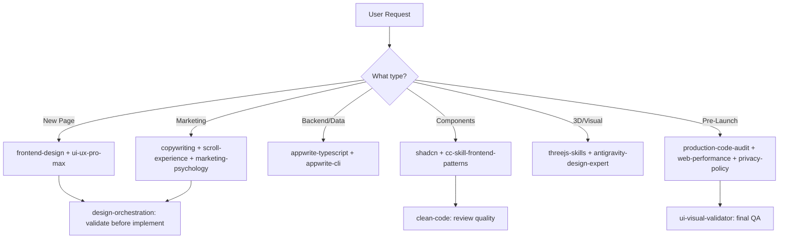

# Skills Inventory & Reanalysis — AmarBhaiya.in

> All **27 skills** read and internalized. Below is a categorized synthesis with relevance scores for the AmarBhaiya.in project (Next.js 16 + Appwrite LMS platform).

---

## Project Context Snapshot

| Dimension | Current State |
|-----------|--------------|
| **Stack** | Next.js 16.2.1, React 19, Tailwind v4, Appwrite (node-appwrite + appwrite), shadcn/ui, Razorpay, Stream Chat |
| **Architecture** | Route groups: `(auth)`, `(dashboard)`, `(marketing)` + API routes |
| **Components** | Navbar, Footer, Hero, Motion Drawer, Theme Toggle, Course components, UI primitives |
| **3D/Motion** | Three.js, React Three Fiber, Framer Motion, ShaderGradient |
| **Data** | Appwrite TablesDB, Zod validators, server actions |
| **Payments** | Razorpay + PhonePe integration |
| **Comms** | Stream Chat, EmailJS |

---

## Skill Categories & Relevance

### 🔴 CRITICAL — Use Immediately

| # | Skill | Relevance | Why |
|---|-------|-----------|-----|
| 1 | **appwrite-typescript** | ★★★★★ | Core backend SDK. Must follow `TablesDB` (not deprecated `Databases`), object-params style, SSR auth cookie pattern, `Permission`/`Role` helpers. Your auth.ts already needs this. |
| 2 | **appwrite-cli** | ★★★★★ | Deploy tables/buckets/teams/topics. Use `appwrite push tables --all --force` for CI/CD. Generate type-safe SDK with `appwrite generate`. |
| 3 | **shadcn** + **shadcn-ui** | ★★★★★ | You have `components.json` and shadcn installed. Must use `FieldGroup`+`Field` for forms, `gap-*` not `space-y-*`, semantic colors (`bg-primary`), `size-*` for equal dimensions, `data-icon` for button icons. |
| 4 | **production-code-audit** | ★★★★★ | Pre-launch necessity. Autonomous codebase scan for security (hardcoded keys, SQL injection), performance (N+1, bundle size), code quality (god classes, dead code). |
| 5 | **cc-skill-frontend-patterns** | ★★★★☆ | Component composition, compound components, render props, custom hooks (useQuery, useDebounce), virtualization, error boundaries — all essential for the LMS dashboard. |

### 🟠 HIGH — Use During Active Development

| # | Skill | Relevance | Why |
|---|-------|-----------|-----|
| 6 | **frontend-design** | ★★★★☆ | Avoid generic AI aesthetics. Every page needs a BOLD direction — commit to distinctive fonts (not Inter/Roboto), curated palettes, motion with purpose. Use CSS variables for consistency. |
| 7 | **antigravity-design-expert** | ★★★★☆ | Floating UI cards, glassmorphism, parallax, GSAP ScrollTrigger, isometric grids — perfect for the marketing/landing pages. Enforce `prefers-reduced-motion` and `will-change: transform`. |
| 8 | **scroll-experience** | ★★★★☆ | Marketing pages need scroll-driven storytelling: GSAP ScrollTrigger, parallax layers, sticky sections, staggered reveals. Anti-patterns: no scroll hijacking, mobile-first. |
| 9 | **threejs-skills** | ★★★★☆ | You already have Three.js + R3F + ShaderGradient. Use import maps for prototypes, `setAnimationLoop`, `THREE.Timer` (r183), proper resize handling, GSAP integration. |
| 10 | **clean-code** | ★★★★☆ | Functions < 20 lines, intention-revealing names, no side effects, Law of Demeter. Apply during every PR review. |
| 11 | **ui-ux-pro-max** | ★★★★☆ | 659 lines of UX rules. Priority 1-3 are CRITICAL: accessibility (4.5:1 contrast, ARIA), touch targets (44×44pt), performance (WebP, lazy loading, CLS < 0.1). Run `--design-system` for the LMS. |
| 12 | **web-performance-optimization** | ★★★★☆ | Core Web Vitals targets: LCP < 2.5s, FID < 100ms, CLS < 0.1. Image optimization (WebP/AVIF), code splitting, lazy loading, critical CSS. |

### 🟡 MEDIUM — Use for Specific Features

| # | Skill | Relevance | Why |
|---|-------|-----------|-----|
| 13 | **copywriting** | ★★★☆☆ | Landing page copy. Phase 1: context gathering (audience, CTA, awareness level). Phase 2: copy brief lock. No fabricated claims. |
| 14 | **copy-editing** | ★★★☆☆ | Seven Sweeps: Clarity → Voice → So What → Prove It → Specificity → Emotion → Zero Risk. Apply to all marketing pages. |
| 15 | **content-marketing** | ★★★☆☆ | Blog/SEO strategy for AmarBhaiya. Validate search demand first. Content-market fit. Consistency > virality. |
| 16 | **marketing-psychology** | ★★★☆☆ | Social proof, anchoring (pricing page), loss aversion, IKEA effect (course builder), goal-gradient (progress bars). |
| 17 | **design-orchestration** | ★★★☆☆ | Meta-skill for routing design decisions: brainstorm → risk assess → escalate → implement. Use for high-risk features. |
| 18 | **privacy-policy** | ★★★☆☆ | Must-have for launch. Covers GDPR, CCPA, data collection mapping, cookie policy, children's privacy (education platform). |
| 19 | **ui-ux-designer** | ★★★☆☆ | Atomic design, WCAG 2.2, Figma workflow, cross-platform consistency. Good reference for design system governance. |
| 20 | **ui-visual-validator** | ★★★☆☆ | Pre-launch QA. Systematic visual audit: pixel-perfect, responsive breakpoints, dark mode, accessibility overlays. |
| 21 | **theme-factory** | ★★★☆☆ | 10 pre-built themes. Use for course materials, reports, or marketing variants. |

### 🔵 LOW — Situational Use

| # | Skill | Relevance | Why |
|---|-------|-----------|-----|
| 22 | **senior-architect** | ★★☆☆☆ | Architecture diagrams, dependency analysis. Use when scaling or refactoring the platform. |
| 23 | **senior-fullstack** | ★★☆☆☆ | Scaffolding, code quality analyzer. Overlaps with production-code-audit. |
| 24 | **codex-review** | ★★☆☆☆ | Auto CHANGELOG, code review before commits. Nice-to-have for CI/CD. |
| 25 | **startup-analyst** | ★★☆☆☆ | TAM/SAM/SOM, financial modeling, competitive analysis. Use if raising funds or doing market research. |
| 26 | **ui-skills** | ★☆☆☆☆ | Minimal content — just links to source repository. |

---

## Key Insights from Skill Analysis

### 1. Appwrite SDK Patterns Are Non-Negotiable

Your codebase uses Appwrite. The skills define **mandatory patterns**:

```typescript
// ✅ CORRECT: Use TablesDB, object-params, SSR auth cookies
const tablesDB = new TablesDB(client);
const results = await tablesDB.listRows({
    databaseId: DB_ID,
    tableId: TABLE_ID,
    queries: [Query.equal('status', 'active')]
});

// ❌ WRONG: Using deprecated Databases class, positional args
```

> [!IMPORTANT]
> The `Databases` class is deprecated. All new code must use `TablesDB`. SSR auth requires admin + session client separation with `a_session_<PROJECT_ID>` cookies.

### 2. shadcn/ui Has Strict Rules

Your project has `components.json`. The shadcn skill enforces:
- `gap-*` instead of `space-y-*`
- `size-*` instead of `w-* h-*` for equal dimensions  
- Semantic colors only (`bg-primary`, not `bg-blue-500`)
- `FieldGroup` + `Field` for forms (not raw divs)
- `data-icon` attribute on icons inside buttons
- Always check `isRSC` — add `"use client"` for interactive components

### 3. The 3D Stack Is Premium But Risky

You have Three.js r183 + R3F + ShaderGradient + Framer Motion. The skills say:
- Use `THREE.Timer` instead of `THREE.Clock` (r183+)
- Prefer `setAnimationLoop` over manual `requestAnimationFrame`
- GSAP for complex timeline animations
- Always respect `prefers-reduced-motion`
- Dispose of geometries/materials/textures when removing objects

### 4. Performance Is a Launch Blocker

Multiple skills converge on performance requirements:
- **LCP < 2.5s**, **FID < 100ms**, **CLS < 0.1**
- WebP/AVIF images, lazy loading, code splitting
- Bundle size < 200KB gzipped
- Virtualize lists with 50+ items
- Font-display: swap, preload critical fonts only

### 5. Marketing Pages Need Scroll Storytelling

The `scroll-experience` + `antigravity-design-expert` skills define a premium approach:
- Parallax layers at different speeds (background: 0.2x, foreground: 1.0x)
- GSAP ScrollTrigger with scrub animations
- Story beats: Hook → Context → Journey → Climax → CTA
- Staggered entrances (0.1s per element)
- Never hijack scroll, always degrade gracefully on mobile

---

## Recommended Immediate Actions

| Priority | Action | Skills to Apply |
|----------|--------|-----------------|
| 🔴 1 | Audit auth.ts and all Appwrite code for TablesDB migration | `appwrite-typescript` |
| 🔴 2 | Run production code audit on entire codebase | `production-code-audit` |
| 🔴 3 | Verify all shadcn components follow strict rules | `shadcn` |
| 🟠 4 | Optimize images and bundle for Core Web Vitals | `web-performance-optimization` |
| 🟠 5 | Apply scroll storytelling to marketing pages | `scroll-experience`, `antigravity-design-expert` |
| 🟠 6 | Run UI/UX checklist against all pages | `ui-ux-pro-max` |
| 🟡 7 | Write marketing copy for landing page | `copywriting`, `content-marketing` |
| 🟡 8 | Draft privacy policy for launch | `privacy-policy` |

---

## Cross-Skill Synergies


